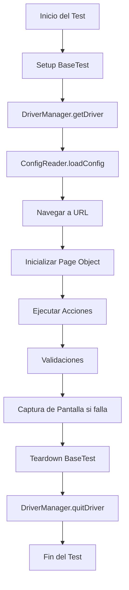

# 🏗️ Arquitectura del Framework de Automatización

## Visión General

El framework de automatización de Kernotec está diseñado siguiendo principios de arquitectura sólida, patrones de diseño establecidos y mejores prácticas de la industria. Esta arquitectura garantiza escalabilidad, mantenibilidad y reutilización de código.

## Patrones de Diseño Implementados

### 1. Page Object Model (POM)

- **Propósito**: Separar la lógica de UI de la lógica de test
- **Beneficios**: Mantenibilidad, reutilización, legibilidad
- **Implementación**: Clases `BasePage`, `LoginPage`, `HomePage`, `DashboardPage`

### 2. Factory Pattern

- **Propósito**: Creación centralizada de WebDrivers
- **Implementación**: Clase `DriverManager`
- **Beneficios**: Gestión consistente de drivers, soporte multi-browser

### 3. Singleton Pattern

- **Propósito**: Instancia única de configuraciones
- **Implementación**: `ConfigReader`, `YamlConfigReader`
- **Beneficios**: Acceso global, consistencia de configuración

### 4. Builder Pattern

- **Propósito**: Construcción flexible de objetos complejos
- **Implementación**: Configuración de WebDriver options
- **Beneficios**: Flexibilidad, legibilidad del código

## Estructura de Capas

```
┌─────────────────────────────────────────────────────────────┐
│                    CAPA DE TESTS                            │
│  ┌─────────────────┐ ┌─────────────────┐ ┌─────────────────┐ │
│  │   SmokeTests    │ │  LoginTests     │ │NavigationTests  │ │
│  └─────────────────┘ └─────────────────┘ └─────────────────┘ │
└─────────────────────────────────────────────────────────────┘
┌─────────────────────────────────────────────────────────────┐
│                 CAPA DE PAGE OBJECTS                       │
│  ┌─────────────────┐ ┌─────────────────┐ ┌─────────────────┐ │
│  │   LoginPage     │ │   HomePage      │ │ DashboardPage   │ │
│  └─────────────────┘ └─────────────────┘ └─────────────────┘ │
│  ┌─────────────────────────────────────────────────────────┐ │
│  │                   BasePage                             │ │
│  └─────────────────────────────────────────────────────────┘ │
└─────────────────────────────────────────────────────────────┘
┌─────────────────────────────────────────────────────────────┐
│                  CAPA DE UTILIDADES                        │
│  ┌─────────────────┐ ┌─────────────────┐ ┌─────────────────┐ │
│  │ WebDriverUtils  │ │ ScreenshotUtils │ │   ExcelUtils    │ │
│  └─────────────────┘ └─────────────────┘ └─────────────────┘ │
│  ┌─────────────────────────────────────────────────────────┐ │
│  │                   DateUtils                            │ │
│  └─────────────────────────────────────────────────────────┘ │
└─────────────────────────────────────────────────────────────┘
┌─────────────────────────────────────────────────────────────┐
│                  CAPA DE CONFIGURACIÓN                     │
│  ┌─────────────────┐ ┌─────────────────┐ ┌─────────────────┐ │
│  │  DriverManager  │ │  ConfigReader   │ │YamlConfigReader │ │
│  └─────────────────┘ └─────────────────┘ └─────────────────┘ │
│  ┌─────────────────────────────────────────────────────────┐ │
│  │                  TestConfig                            │ │
│  └─────────────────────────────────────────────────────────┘ │
└─────────────────────────────────────────────────────────────┘
┌─────────────────────────────────────────────────────────────┐
│                   CAPA DE DATOS                            │
│  ┌─────────────────┐ ┌─────────────────┐ ┌─────────────────┐ │
│  │TestDataProvider │ │ UserCredentials │ │   ExcelUtils    │ │
│  └─────────────────┘ └─────────────────┘ └─────────────────┘ │
└─────────────────────────────────────────────────────────────┘
```

## Componentes Principales

### 1. Gestión de Drivers

```java
public class DriverManager {
    // Gestión centralizada de WebDrivers
    // Soporte para Chrome, Firefox, Edge
    // Configuración automática de drivers
}
```

### 2. Configuración

```java
public class ConfigReader {
    // Lectura de configuraciones YAML
    // Gestión de ambientes
    // Configuraciones dinámicas
}
```

### 3. Page Objects

```java
public abstract class BasePage {
    // Funcionalidades comunes
    // Métodos de espera
    // Interacciones básicas
}
```

### 4. Utilidades

```java
public class WebDriverUtils {
    // Métodos de espera
    // Interacciones avanzadas
    // Validaciones
}
```

## Flujo de Ejecución



## Gestión de Datos

### Fuentes de Datos

1. **Configuración YAML**: Credenciales y configuraciones
2. **Archivos Excel**: Datos tabulares de usuarios
3. **Archivos JSON**: Escenarios de prueba complejos
4. **Data Providers**: Datos dinámicos para TestNG

### Estrategia de Datos

```java
// Prioridad de fuentes de datos:
1. Configuración YAML (application.yml)
2. Archivos Excel (users.xlsx)
3. Datos hardcodeados (fallback)
```

## Gestión de Errores

### Estrategias de Recuperación

1. **Retry Logic**: Reintentos automáticos en fallos
2. **Screenshots**: Capturas automáticas en errores
3. **Logging**: Registro detallado de errores
4. **Graceful Degradation**: Continuación de tests cuando es posible

### Manejo de Excepciones

```java
try {
    // Operación de UI
} catch (Exception e) {
    logger.error("Error en operación: {}", e.getMessage());
    ScreenshotUtils.takeFailureScreenshot(testName);
    throw new RuntimeException("Test fallido", e);
}
```

## Configuración de Ambientes

### Ambientes Soportados

- **Development**: Desarrollo local
- **Testing**: Ambiente de pruebas
- **Staging**: Pre-producción
- **Production**: Producción

### Configuración por Ambiente

```yaml
environments:
  dev:
    baseUrl: "https://dev.kernotec.com"
  test:
    baseUrl: "https://test.kernotec.com"
  staging:
    baseUrl: "https://staging.kernotec.com"
```

## Escalabilidad

### Ejecución Paralela

- Soporte para ejecución multi-thread
- Gestión de ThreadLocal para drivers
- Configuración de paralelismo por suite

### Extensibilidad

- Fácil adición de nuevos browsers
- Nuevos Page Objects sin modificar código existente
- Nuevas fuentes de datos
- Nuevos tipos de reportes

## Seguridad

### Gestión de Credenciales

- Credenciales en archivos de configuración
- Enmascaramiento en logs
- Variables de entorno para producción

### Validaciones de Seguridad

- Validación de URLs
- Sanitización de inputs
- Verificación de permisos

## Performance

### Optimizaciones

- Lazy loading de configuraciones
- Reutilización de drivers cuando es posible
- Timeouts configurables
- Limpieza automática de recursos

### Monitoreo

- Logging de performance
- Métricas de tiempo de ejecución
- Detección de memory leaks

## Mantenibilidad

### Principios SOLID

- **S**: Single Responsibility Principle
- **O**: Open/Closed Principle
- **L**: Liskov Substitution Principle
- **I**: Interface Segregation Principle
- **D**: Dependency Inversion Principle

### Código Limpio

- Nombres descriptivos
- Métodos pequeños y enfocados
- Documentación JavaDoc
- Comentarios donde sea necesario

## Testing del Framework

### Estrategias de Testing

1. **Unit Tests**: Para utilidades y configuraciones
2. **Integration Tests**: Para Page Objects
3. **End-to-End Tests**: Para flujos completos

### Validación de Arquitectura

- Verificación de patrones implementados
- Validación de separación de capas
- Testing de configuración

## Evolución del Framework

### Roadmap

1. **v1.1**: Soporte para API testing
2. **v1.2**: Integración con CI/CD
3. **v1.3**: Soporte para mobile testing
4. **v2.0**: Arquitectura basada en microservicios

### Migración

- Plan de migración documentado
- Compatibilidad hacia atrás
- Herramientas de migración automatizada

---

_Framework desarrollado por el equipo de QA de Kernotec - Versión 1.0.0_
